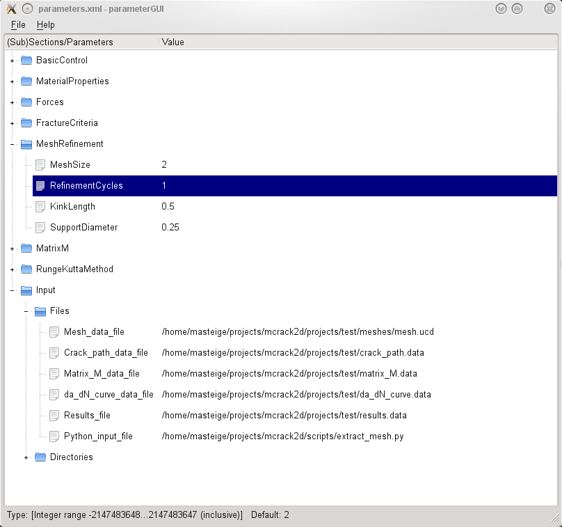

# This repository contains the parameter_gui project.

It is copyrighted by Martin Steigemann and Wolfgang Bangerth and
distributed under the same license as the deal.II library, i.e. The GNU
Lesser General Public License (LGPL) version 2.1 or later.

Requirements:
=============

- CMake
- <a href="https://www.qt.io/developers/">Qt toolkit</a>

Usage:
======

To use the parameter GUI you first need to write a description of all the
parameters, their default values, patterns and documentation strings into a
file in a format that the GUI can understand; this is done using the
ParameterHandler::print_parameters() function with ParameterHandler::XML as
second argument, as discussed in more detail below in the <i>Representation
of Parameters</i> section. This file can then be loaded using the
executable of this GUI.

Once loaded, the GUI displays subsections and individual parameters in tree
form (see also the discussion in the <i>Representation of Parameters</i>
section below). Here is a screen shot with some sub-sections expanded and
one parameter selected for editing:

Using the GUI, you can edit the values of individual parameters and save
the result in the same format as before. It can then be read in using the
ParameterHandler::read_input_from_xml() function.
